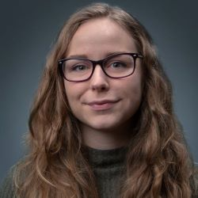

  
[About](##about-me) | [Projects](portfolio.md) | [Leadership](activities.md) | [Education](education.md) | [Experience](experience.md)
  

# About Me
I'm a software engineer located in the greater Seattle area of Washington. I earned a Bachelor's degree in Computer Science and Software Engineering at the University of Washington Bothell in June 2021. 

## Languages/Technologies I have used:
- Python
- Java
- C++
- C
- UNIX/git bash
- LaTeX
- Markdown
- R
- MatLab
- SQLite

